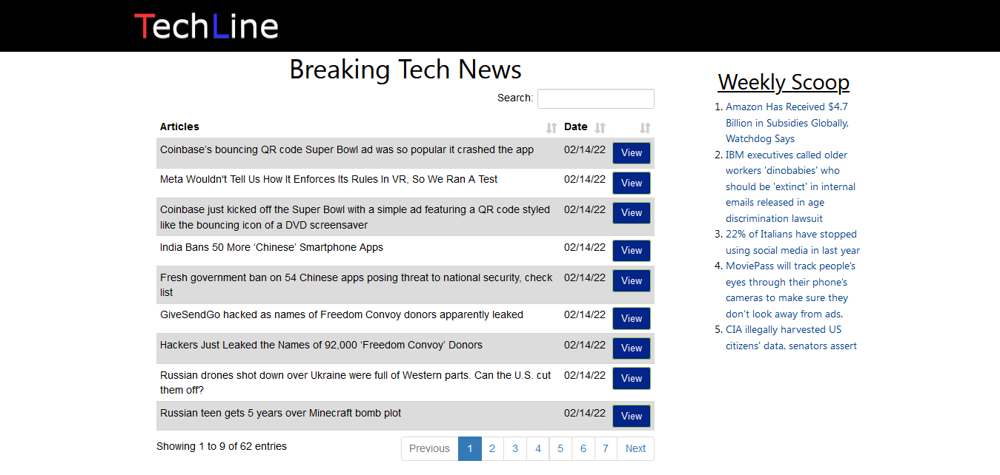

<!-- PROJECT SHIELDS -->
<!--
*** I'm using markdown "reference style" links for readability.
*** Reference links are enclosed in brackets [ ] instead of parentheses ( ).
*** See the bottom of this document for the declaration of the reference variables
*** for contributors-url, forks-url, etc. This is an optional, concise syntax you may use.
*** https://www.markdownguide.org/basic-syntax/#reference-style-links
-->

  

<!-- PROJECT LOGO -->
 

  

   
   

  

  A fresh, responsive, fully-automated, technology news platform. :satellite:
     
    <a href="https://jesusyanez.github.io/Techline/"><strong>View Demo »</strong></a>
     
     
  

  

<!-- ABOUT THE PROJECT -->
## About The Project

 

This project basically collects the top posts from the r/technology subreddit and displays them on a custom site.

Main features:
* Reddit API scraping
* Data cleaning/manipulation
* Displaying CSV data
* Self-updating
* Complete automation
* Responsive design

(<a href="#top">back to top</a>)

### Built With

* [Python](https://www.python.org/)
* [Bootstrap](https://getbootstrap.com)
* [JavaScript](https://www.javascript.com/)
* [Node.js](https://nodejs.org/)
* [jQuery](https://jquery.com/)

#### Other tools
* [Reddit API](https://www.reddit.com/dev/api/)
* [Raspberry Pi OS / Linux](https://www.raspberrypi.com/software/)
 * [Bash](https://www.gnu.org/software/bash/)
 * [Cron job](https://en.wikipedia.org/wiki/Cron)
* [GitHub Pages](https://pages.github.com/)

#### Abandoned tools
* [AWS Lightsail](https://aws.amazon.com/lightsail/)
 * [Windows Server 2016](https://www.microsoft.com/en-us/windows-server)

(<a href="#top">back to top</a>)

<!-- ROADMAP -->
## Roadmap

- [x] Host on GitHub Pages
- [x] Create README
- [ ] Add REACT front-end
  - [ ] Infinite scroll
- [ ] Create FANG counter
- [ ] Add user profiles
  - [ ] Customized feed

(<a href="#top">back to top</a>)

<!-- LICENSE -->
## License

Distributed under the MIT License. See `LICENSE.txt` for more information.

(<a href="#top">back to top</a>)

<!-- CONTACT -->
## Contact

Jesus Yanez - [@gitjit](https://twitter.com/gitjit) - jryanez@jryanez.com

Project Link: [https://github.com/jesusyanez/Techline](https://github.com/jesusyanez/Techline)

(<a href="#top">back to top</a>)

<!-- ACKNOWLEDGMENTS -->
## Acknowledgments

* [PRAW  (Python Reddit API Wrapper)](https://praw.readthedocs.io/en/stable/)
* [PANDAS](https://pandas.pydata.org/)
* [ derekeder / csv-to-html-table ](https://github.com/derekeder/csv-to-html-table)
* [ JosephLai241 /
URS](https://github.com/JosephLai241/URS)
* [ othneildrew /
Best-README-Template ](https://github.com/othneildrew/Best-README-Template)

(<a href="#top">back to top</a>)

